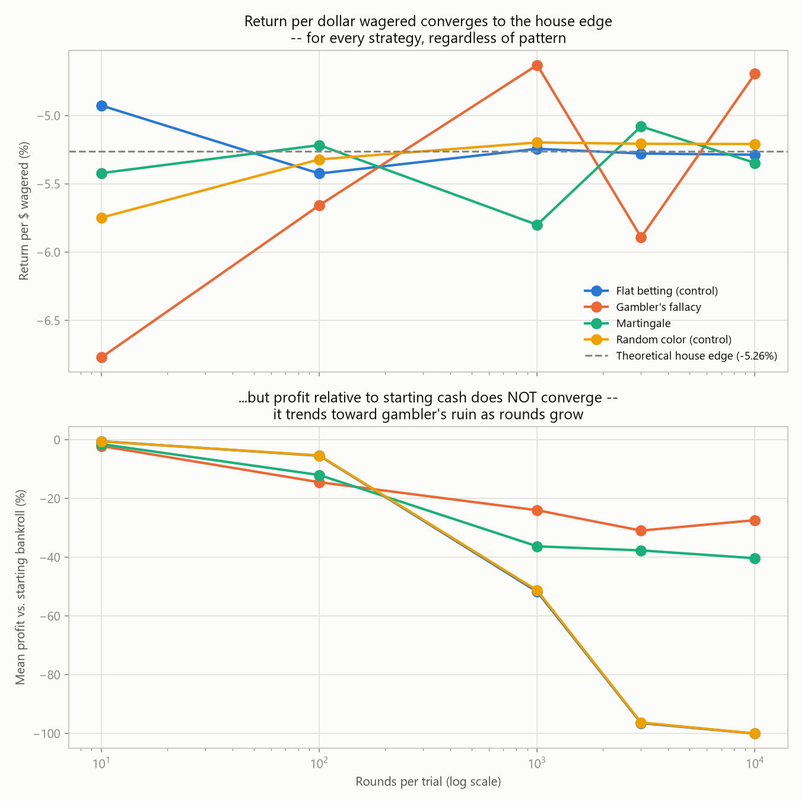
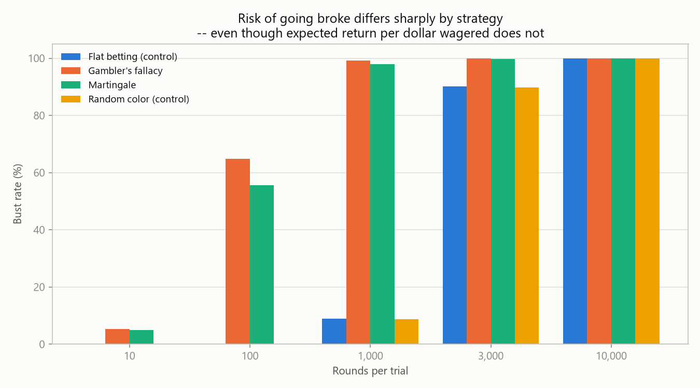
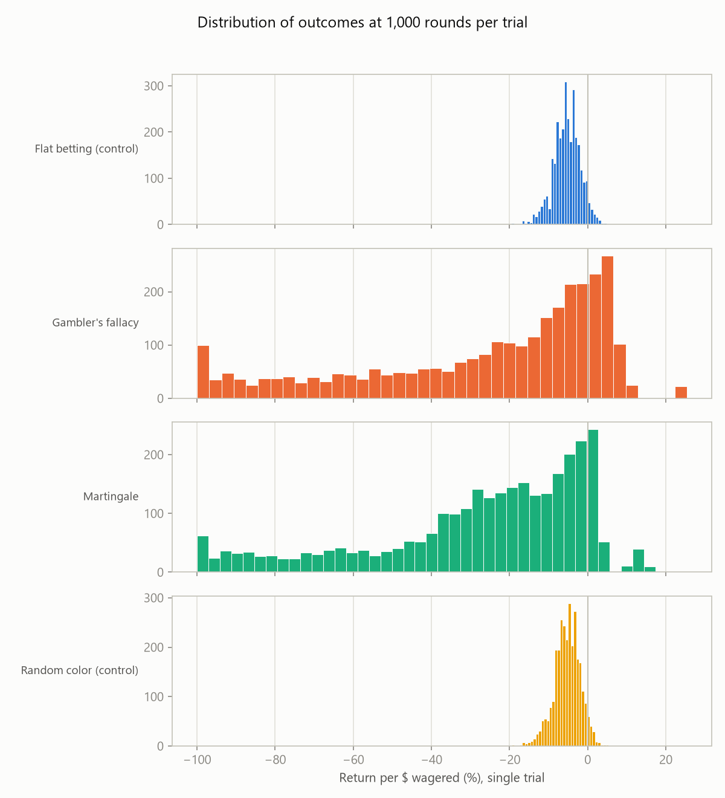

# Roulette: a statistics playground

This project uses a roulette simulator to explore two ideas from
probability and statistics: **regression to the mean** (the real
phenomenon) and the **gambler's fallacy** (the false belief people
often confuse it with). It is not a system for beating roulette —
nothing here can, and the simulator itself is built to demonstrate why.

**The thesis, stated up front:** no betting pattern changes the expected
value of an independent random game. Betting on red because black just
hit five times in a row doesn't change the odds of the next spin — each
spin is independent. What *does* regress to a stable value, given enough
trials, is the *sample average outcome*, via the law of large numbers.
The four strategies below all converge to the same long-run edge despite
looking nothing alike, and they differ wildly in one thing only: risk.

## Roulette mechanics

This is American roulette: 38 pockets — 18 red, 18 black, 2 green (0 and
00). Every strategy here places even-money bets on a color. The house
edge on an even-money bet is:

```
(18 wins - 20 losses) / 38 bets = -1/19 ≈ -5.263%
```

per dollar wagered. That number, `kTheoreticalHouseEdgePercent` in
[`src/statistics.h`](src/statistics.h), is the fixed target every chart
in this README is checking a strategy's results against.

## Gambler's fallacy vs. regression to the mean

These two ideas get conflated constantly, and this project exists partly
to keep them straight:

- **Gambler's fallacy**: the false belief that an independent random
  process "owes" a correction — that after several reds, black is "due."
  It isn't. The wheel has no memory. This project's original 2021
  algorithm (now [`GamblersFallacyStrategy`](src/strategies.cpp)) does
  exactly this: it bets against whichever color has led so far.
- **Regression to the mean**: the real phenomenon that *sample averages*
  converge toward the *true* expected value as sample size grows (the law
  of large numbers). It says nothing about individual future outcomes —
  only that your running average gets more reliable, and less extreme,
  the more data you collect.

The simulator makes this concrete by tracking **return per dollar
wagered** (total profit ÷ total amount bet) alongside the more familiar
**profit relative to starting bankroll**. The first metric converges
cleanly to the house edge for every strategy as more bets are placed.
The second does *not* converge to anything — it trends toward -100% as
rounds increase, because a negative-edge game played indefinitely leads
to [gambler's ruin](https://en.wikipedia.org/wiki/Gambler%27s_ruin) with
near-certainty, regardless of strategy. Both are real, correct, and
answering different questions — see [Two ways to measure "did it
work?"](#two-ways-to-measure-did-it-work) below.

## The four strategies

| Strategy | What it does | What it's testing |
|---|---|---|
| `flat` | Fixed bet, fixed color (red), never reacts to history | Control group |
| `fallacy` | Bets against whichever color has led so far; bet size grows with the cumulative loss streak | The gambler's fallacy, dressed up as a "system" |
| `martingale` | Always bets the same color; doubles the bet after every loss, resets after a win | The textbook doubling system |
| `random` | Fixed bet size, but the color is chosen uniformly at random each round | Control group, with no fixed pattern at all |

All four are expected — and, per the charts below, observed — to converge
to the same ~-5.26% return per dollar wagered as bet counts grow. None of
them can escape the house edge. What differs enormously is **bust rate**:
the escalating strategies (`fallacy`, `martingale`) go broke far faster
than the flat-bet controls, for the same reason any exponential-ish bet
growth against a hard bankroll ceiling does — see the bust-risk chart
below.

## Build & run

### CMake (Linux / macOS / Windows with g++, clang, or MSVC)

```sh
cmake -B build
cmake --build build --config Release
./build/roulette_sim --trials 3000 --seed 42
```

### Visual Studio (Windows)

Open `Roulette.sln`, select a Release configuration (Win32 or x64), and
build. The compiled binary lands in `x64\Release\Roulette.exe` (or the
equivalent Debug/Win32 path). Both build paths compile the same `src/`
source tree.

## CLI usage

```
roulette_sim [options]
  --strategies <list>     Comma-separated strategy names (default: all)
                           Available: flat, fallacy, martingale, random
  --round-counts <list>   Comma-separated round counts per trial
                           (default: 10,100,1000,3000,10000)
  --trials <N>            Trials per (strategy, round-count) combo (default: 1000)
  --initial-total <int>   Starting cash (default: 1000)
  --initial-wager <int>   Base bet (default: 10)
  --growth-rate <double>  Gambler's-fallacy escalation multiplier (default: 1.5)
  --seed <uint>           RNG seed, for reproducible runs (default: random)
  --output-dir <path>     Where trials.csv/summary.csv are written (default: output)
  --trace <path>          Write a round-by-round log of the first trial of each
                           combo to this file (default: off)
  --help                  Show this message
```

Example:

```sh
roulette_sim --trials 3000 --seed 42
```

## Output files

Every run writes two CSVs to `--output-dir` (default `output/`):

**`trials.csv`** — one row per individual trial: `strategy`, `round_count`,
`trial_index`, `initial_total`, `final_total`, `percent_profit`,
`total_wagered`, `return_on_wagered_percent`, `busted`, `bust_round`,
`biggest_loss`, `num_red`, `num_black`, `num_green`.

**`summary.csv`** — one row per (strategy, round-count) combination, with
the aggregated statistics computed in [`src/statistics.cpp`](src/statistics.cpp):
mean/stddev/stderr/95% CI for both `percent_profit` and
`return_on_wagered_percent`, the **pooled** return on wagered (see below),
`bust_rate`, `mean_final_total`, and the constant
`theoretical_house_edge_percent` for reference.

## Example output

```
strategy        rounds     mean %  pooled/$wagered     bust rate
----------------------------------------------------------------
flat                10      -0.49           -4.93          0.0%
flat               100      -5.42           -5.42          0.0%
flat              1000     -51.70           -5.24          9.0%
flat              3000     -96.42           -5.28         90.1%
flat             10000    -100.00           -5.29        100.0%
fallacy             10      -2.12           -6.77          5.3%
fallacy            100     -14.43           -5.66         64.9%
fallacy           1000     -23.96           -4.63         99.2%
fallacy           3000     -30.90           -5.89        100.0%
fallacy          10000     -27.34           -4.69        100.0%
martingale          10      -1.47           -5.42          4.9%
martingale         100     -11.98           -5.22         55.7%
martingale        1000     -36.25           -5.80         98.0%
martingale        3000     -37.64           -5.08         99.7%
martingale       10000     -40.31           -5.35        100.0%
random              10      -0.57           -5.75          0.0%
random             100      -5.32           -5.32          0.0%
random            1000     -51.25           -5.20          8.7%
random             3000    -96.22           -5.21         89.7%
random            10000   -100.00           -5.21        100.0%

Theoretical house edge (return per dollar wagered): -5.263%
```

(3,000 trials per row, seed 42 — regenerate with
`roulette_sim --trials 3000 --seed 42`.)

### Two ways to measure "did it work?"



Top panel: **return per dollar wagered**, pooled across every trial in
each group. Every strategy hugs the -5.26% line, regardless of pattern —
this is the regression-to-the-mean story. Bottom panel: **profit
relative to starting bankroll**, for the exact same runs. It doesn't
converge to anything — it slides toward -100% as rounds increase, because
enough rounds against a negative edge means near-certain ruin. Same
underlying data, two different questions, two very different pictures.

### Risk differs even when expected value doesn't



`fallacy` and `martingale` go broke far more often, far sooner, than the
flat-bet controls — because escalating a bet after a loss accelerates the
walk toward the bankroll floor, even though each individual bet still has
exactly the same -5.26%-per-dollar expected value as a flat bet.

### Outcome spread by strategy



At a fixed round count, the flat and random controls produce a tight,
roughly bell-shaped spread of outcomes. The escalating strategies produce
a much wider, lopsided spread with a cluster of near-total losses — same
average edge, very different experience.

## Python visualization script

```sh
pip install -r requirements.txt
python scripts/visualize.py --trials-csv output/trials.csv --summary-csv output/summary.csv --output-dir plots/
```

Produces the three charts above (`convergence.png`, `bust_risk.png`,
`profit_distributions.png`) from any `trials.csv`/`summary.csv` the C++
program writes. It only visualizes — every statistic it plots was already
computed in C++.

## Known limitations & subtleties

- **`random`'s color pick shares the wheel's RNG engine.** Both are fed
  the same `std::mt19937`, seeded once in `main()`. This is a deliberate
  simplification (one seed = one fully reproducible run via `--seed`)
  rather than statistically independent streams; it hasn't shown any
  observable correlation artifact in testing, but it's worth knowing if
  you extend this.
- **95% CIs use the normal approximation** (`mean ± 1.96 × stderr`), which
  is only reliable once `--trials` is in the hundreds or more — the
  default (1000) comfortably clears that bar.
- **Averaging per-trial ratios is unstable and is not the headline
  metric.** `summary.csv` also reports `mean_return_on_wagered_percent`
  (the mean of each trial's own ratio), kept for illustration — it can
  swing wildly for the escalating strategies because a handful of trials
  with a small `total_wagered` and a lucky large bet produce extreme
  ratios. `pooled_return_on_wagered_percent` (total profit ÷ total wagered
  *across every trial in the group*) is the statistically sound version
  and is what the convergence chart plots. This is the classic "mean of
  ratios ≠ ratio of means" pitfall, and it's a real one — not specific to
  gambling data.
- **Gambler's ruin caps how much data "more rounds" actually buys you.**
  For `fallacy` and `martingale`, once a round-count ceiling exceeds the
  typical number of rounds before bust, raising it further stops adding
  real data — most trials already stopped early. Tightening those
  strategies' estimates further takes more `--trials`, not a higher
  `--round-counts` ceiling.
- **`input.txt` and file-based historical data are gone.** An earlier
  version of this README described reading historical red/black results
  from a file; that was never implemented in the code it described, and
  wasn't reintroduced here — every strategy here reacts only to outcomes
  generated within its own trial.

## Repository layout

```
src/            C++ simulator (wheel, strategies, simulation loop, statistics, CSV output, CLI)
CMakeLists.txt  Cross-platform build (g++ / clang / MSVC)
Roulette.sln/   Visual Studio build, same src/ tree
Roulette.vcxproj
scripts/        Python visualization script
docs/images/    Sample charts referenced by this README
output/         Generated CSVs (gitignored)
plots/          Generated charts (gitignored)
```

---

Originally written in 2021 by Zeb Kleinsorge as a Martingale-strategy
experiment; rebuilt in 2026 into a multi-strategy statistics playground.
